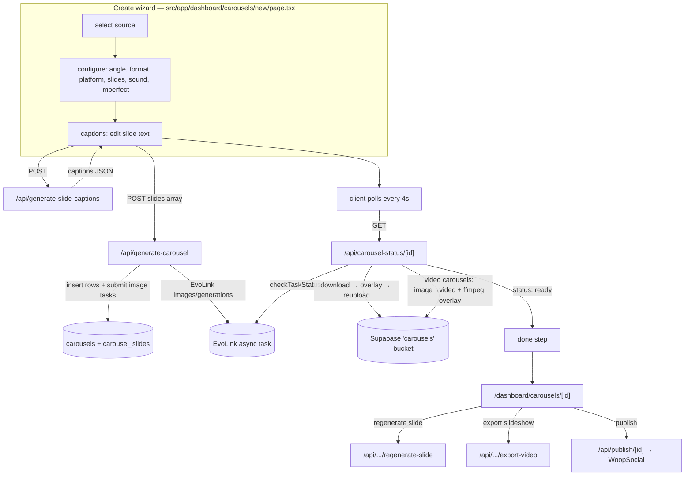

# Carousel Generation Pipeline

> Repository codename: **CarouselAI** · Product: **Mymo**

This is the **engineering map of how a carousel gets made** — every stage from "user
picks a source" to "captioned slide images / video clips / exported MP4", with the exact
files, functions, models, and tunable knobs at each step. It's written to be a working
reference for **adjusting** the pipeline.

For business positioning see `PROJECT_OVERVIEW.md`; for in-app product + design see
`DESIGN_AND_PRODUCT_OVERVIEW.md`. This document is the **generation internals**.

---

## 1. The core idea (read this first)

The single most important architectural decision:

> **The AI image model produces a CLEAN, TEXT-FREE background. All caption text and UI
> chrome (review cards, notification mocks, stars) is drawn ON TOP server-side with
> `@napi-rs/canvas` (and `ffmpeg` for video).**

Why: text rendered by image models is misspelled, inconsistent, and ignores platform safe
zones. By splitting "background generation" (AI) from "text compositing" (our canvas
renderer), captions are pixel-sharp, spelled exactly as written, identical across slides,
and respect the feed-UI safe zones.

This split is what most of the pipeline complexity exists to serve.

```
                 TEXT (LLM)                  IMAGE (AI)                 OVERLAY (us)
            ┌──────────────────┐      ┌──────────────────────┐    ┌────────────────────┐
 brand ───▶ │ slide captions   │      │ clean, text-free     │    │ canvas/ffmpeg burns│
 brain      │ + post caption   │      │ background per slide  │──▶ │ caption + chrome on│──▶ stored asset
            │ + hashtags       │      │ (gpt-image-2)         │    │ (5 named layouts)  │
            └──────────────────┘      └──────────────────────┘    └────────────────────┘
                gemini-3.5-flash          api.evolink.ai              src/lib/carousel/overlay/*
```

---

## 2. Pipeline at a glance



**Multi-asset mode** diverges: it generates clean images first, then writes/burns captions
afterward (see §4.6).

---

## 3. The three creation modes

All three converge on `POST /api/generate-carousel`
(`src/app/api/generate-carousel/route.ts`), but they reach it differently and behave
differently. **This is the most important thing to understand before adjusting anything.**

| Mode | Trigger (request body) | Captions | Image content | Overlay timing |
| ---- | ---------------------- | -------- | ------------- | -------------- |
| **Single-source** | `slides[]` + (`combination_id` \| `custom_topic` \| `template_id` \| `framework_id`) | Written up front in the `captions` step, sent in `slides[]` | Clean background per slide | **Baked at completion** by the status poller (`bakeText: !isVideo`) |
| **Multi-asset** | `slide_sources[]` (≥1 `combination_id`) | Written **after** images exist (fit to actual slides), edited, then finalized | One clean image per selected combination | **Burned by `/finalize`** from `base_image_url` |
| **Video** | Single-source with `media_type: "video"` | Same as single-source | Clean background (kept clean — not baked) | Caption burned **onto the clip** via ffmpeg in the video phase |

Single-source itself has **four sub-flavors** depending on which optional input is present:

- **Approved combination** (`combination_id`) — caption seeded from a reviewed combination.
- **Custom topic** (`custom_topic`) — freeform topic string.
- **Template remix** (`template_id`) — each generated slide references the matching template
  slide image as its primary style guide (slide *i* mimics template slide *i* mod length).
- **Angle framework** (`framework_id`) — server-authoritative per-slide `layout` / `role` /
  `{asset}` routing from one of the T1–T9 frameworks.

These can combine (e.g. framework + combination). Template remix and multi-asset both
*disable* the angle picker in the UI because they already drive slide structure.

---

## 4. Stage-by-stage deep dive

### 4.1 Stage A — Source selection & configuration (client)

**File:** `src/app/dashboard/carousels/new/page.tsx` (the 5/6-step wizard).

Steps: `select → configure → captions → generating → [fit-captions] → done`.

Configuration captured here and passed downstream:

| Setting | Values | Flows to |
| ------- | ------ | -------- |
| `platform` | `instagram` (1:1), `tiktok` (9:16), `both` (4:5) | aspect ratio for image + overlay |
| `media_type` | `image` \| `video` | enables the video phase |
| `slideCount` | 3–10 (locked by framework) | number of captions/slides |
| `frameworkId` | `null` (Auto) or T1–T9 | layout/role/asset routing |
| `imperfect` | bool | "authenticity mode" caption styling |
| `selectedSound` | TikTok trending sound | stored on carousel, used in export |
| `platform` per niche | remix template / combos | source structure |

The client polls `GET /api/carousel-status/{id}` every **4000 ms** (`pollStatus`).

### 4.2 Stage B — Caption generation (text / LLM)

**Route:** `src/app/api/generate-slide-captions/route.ts` (rate limit 15/min).
**Lib:** `src/lib/carousel/prompts.ts`, `src/lib/carousel/inject.ts`.
**Model:** `settings.text_model` (default `gemini-3.5-flash`) via
`https://direct.evolink.ai/v1` (OpenAI SDK, `src/lib/openai/client.ts`).

The route has **three branches**, chosen by which field is present:

1. **`carousel_id` present → multi-asset "fit" captions** (`generateCaptionsForSlides`).
   Captions the *already-generated* slide images. **Multimodal**: sends each slide image to
   the model so the copy matches what's actually shown; falls back to the slide's text
   visual brief if the gateway rejects images.

2. **`framework_id` present → angle injection** (`resolveFramework` in `inject.ts`).
   Resolves the framework's `[Bracket]` text slots from the brand Variable Dictionary in a
   single LLM pass; returns `{ slides, caption, hashtags }`. Falls back to deterministic
   token substitution per slide if the LLM pass fails. **Also produces the post caption +
   hashtags.**

3. **Freeform → `generateSlideCaptions`.** From a `custom_topic` or a combination's caption.
   Returns a `SlideCaption[]` with roles assigned by position (slide 1 = `hook`, last =
   `cta`, middle = `value`).

Caption rules live in the system prompts (`CAPTION_SYSTEM`, `FIT_CAPTION_SYSTEM`,
`inject.SYSTEM_PROMPT`) + the shared **`PRODUCTION_RULES`**
(`src/lib/carousel/production-rules.ts`):
- hook = 3–8 words, value = 5–15 words, cta = 3–10 words;
- "win the first 1.5s", "design for sound-off", "one idea per slide", "outcomes over
  features", "specific verb-first CTA", "native not polished".

**Imperfect mode** (`IMPERFECT_CAPTION_GUIDANCE`) appends guidance for casual lowercase,
slang, and 1–2 believable typos, and bumps temperature `0.7 → 0.9`.

### 4.3 Stage C — Carousel + slide creation & image submission

**Route:** `src/app/api/generate-carousel/route.ts` (rate limit **10/min**).

Sequence (single-source path):

1. Resolve auth → active workspace (`resolveActiveWorkspaceId`) → brand `app_identities`
   row → `assets` → optional framework (`getUsableFramework`) → optional template slide URLs.
2. Insert a `carousels` row (`status: 'generating'`) via `insertCarousel` — which **retries
   without optional columns** (`music`, `framework_id`, `post_caption`, `hashtags`) so it
   works on an un-migrated DB.
3. For each slide:
   - Determine `layout` + `role`: from the framework slide if present, else
     `fullbleed_dark_overlay` + the client role.
   - Build the **image prompt** with `buildImagePrompt(...)` (see §6).
   - Assemble **reference images** (`image_urls`, capped at 16, deduped):
     - template slide first (remix);
     - then framework-routed assets — `split_compare` → first hook + first demo;
       `asset: 'hook'` → all hooks; `'demo'` → all demos; `'logo'` → logo; none → no refs;
     - non-framework → all asset URLs.
   - `buildImagePayload(settings.image_model, prompt, { size, quality: 'medium', image_urls })`
     (`src/lib/evolink/models.ts`) clamps size/quality/refs to the model config.
   - `submitImageGeneration(payload)` → EvoLink async task; store `evolink_task_id`,
     set slide `status: 'generating'` (or `'failed'` on submit error).
4. Insert `carousel_slides` rows via `insertSlides` (also retries without newer columns).
5. If **all** slides failed → carousel reverts to `draft`. Otherwise log a `generated`
   content event (`logContentEvent`) for angle analytics.

Response: `{ carousel_id, media_type, status, slides_submitted, slides_failed }`.

### 4.4 Stage D — Async status polling & image completion

**Route:** `src/app/api/carousel-status/[carouselId]/route.ts`
(`runtime = "nodejs"`, `maxDuration = 60`, rate limit **120/min**).

This route is the **engine** — it's idempotent and incremental, called repeatedly by the
client. Each call:

- **Loads** carousel + slides with graceful degradation (`loadCarousel`, `loadSlides`
  progressively drop columns missing on an un-migrated DB).
- **Phase 1 — advance generating images.** For each slide `status === 'generating'`:
  - no `evolink_task_id` → `failed`; older than **20 min** (`isStaleGenerating`) → `failed`.
  - `checkTaskStatus(taskId)`:
    - `completed` + has result → **`completeSlide`**: `reuploadImage` downloads the EvoLink
      result and re-uploads to the `carousels` bucket at `{ws}/{carousel}/{slide}.png`.
      For **image** carousels (`bakeText: !isVideo`) the caption is composited via
      `renderImageWithOverlay` *before* upload. On upload failure → fall back to raw EvoLink
      URL; on download failure → `failed`.
    - `failed` → `failed`; EvoLink 404 → `failed`.
- **Phase 2 — video** (only `media_type === 'video'`): `runVideoPhase` (see §4.5).
- **Roll up status:** image carousels become `ready` when nothing is generating and ≥1 slide
  completed (`draft` if all failed); video carousels become `ready` when no image is
  generating and every completed image has a finished/failed clip with ≥1 clip completed.

> EvoLink result URLs expire (~24h), which is exactly why everything is re-hosted into our
> own public bucket.

### 4.5 Stage E — Video phase (image → video clips)

**Lib:** `src/lib/carousel/video.ts`; models `src/lib/evolink/video-models.ts`.
**Model:** `settings.video_model` (default `seedance-2.0-fast-image-to-video`).

`runVideoPhase` runs per slide, after its image completes:

1. **2a — submit clip:** image `completed` + clip not started → `submitSlideVideo`. Uses an
   **optimistic claim** (`video_status: null|pending → generating` guarded by `.or(...)`) so
   two overlapping polls can't double-submit. Prompt from `buildVideoPrompt` (shared
   cinematic motion language: gentle push-in, parallax, static text). `buildVideoPayload`
   clamps duration/quality/aspect to the model config.
2. **2b — poll clip:** `generating` + `video_task_id` → `checkTaskStatus`. On `completed`:
   **`completeSlideVideo`** downloads the clip, **burns the caption onto it with ffmpeg**
   (`renderVideoWithOverlay`), and re-uploads to `{ws}/{carousel}/{slide}.mp4`. Stale after
   **30 min** (`VIDEO_STALE_MS`).

Video aspect map differs from images: `instagram` 1:1, `tiktok` 9:16, `both` **3:4**
(`getVideoAspectForPlatform`).

### 4.6 Stage F — Multi-asset fit-captions & finalize

Triggered when the wizard sends `slide_sources[]`.

1. `/api/generate-carousel` (multi-asset branch): one slide per approved combination,
   re-numbered 1..N (roles by position), each a **clean** `fullbleed_dark_overlay` image
   themed by the combination's caption (the caption is **not** written on the image).
   `caption` is `null` at insert.
2. Poller completes the clean images (`bakeText` is effectively off — captions are null).
3. Client `loadFitCaptions` → `/api/generate-slide-captions` with `carousel_id` → multimodal
   "fit" captions → **`SlideCaptionEditor`** (`fit-captions` step).
4. User edits → `POST /api/carousel/[carouselId]/finalize`
   (`src/app/api/carousel/[carouselId]/finalize/route.ts`, rate limit 20/min):
   burns each caption onto the **clean `base_image_url`** and writes to a separate
   `{slide}-final.png`. **Idempotent** — re-finalizing after an edit re-burns from the clean
   base instead of stacking text. Sets carousel `ready`.

### 4.7 Stage G — Regenerate a single slide

**Route:** `src/app/api/carousel/[carouselId]/regenerate-slide/route.ts` (rate limit 20/min).

- **Image carousel:** rebuild the prompt (with `custom_caption` if provided), resubmit to
  EvoLink, reset slide to `generating`, carousel to `generating`. A manual `custom_caption`
  edit logs an `edited` content event.
- **Video carousel** (slide already has an image): just reset the video phase
  (`video_status: pending`, clear `video_task_id/url`) so the poller re-animates the existing
  image — it does **not** regenerate the image.

### 4.8 Stage H — Slideshow video export

**Route:** `src/app/api/carousel/[carouselId]/export-video/route.ts`
(`runtime = "nodejs"`, `maxDuration = 60`; `GET` status 60/min, `POST` render **5/min**).
**Lib:** `src/lib/carousel/video-export.ts` (`renderSlideshow`, ffmpeg-static).

Stitches the **completed slide images** into one MP4 (`perSlideSeconds`, clamped 3–60s
total, ≥1s/slide), letterbox-padded to the platform's canvas size, with optional looped
trending-sound audio. For **video** carousels (whose stored images are clean) it burns the
caption onto each frame first so the slideshow matches the clips. Result stored at
`{ws}/{carousel}/export.mp4`; export state tracked on the carousel row (`export_status`,
`export_video_url`, `export_options`, `export_error`). Logs an `exported` content event.

> `video-export.ts` also has `renderClipReel` (concatenate per-slide *clips* into one Reel),
> available but not yet wired to a route.

---

## 5. The AI layer (EvoLink)

EvoLink is an OpenAI-compatible **AI gateway** used for text, images, and video, via **two
different endpoints**:

| Concern | Endpoint | Client | Default model |
| ------- | -------- | ------ | ------------- |
| **Text** (captions, crawl, injection) | `https://direct.evolink.ai/v1` | OpenAI SDK (`src/lib/openai/client.ts`) | `gemini-3.5-flash` |
| **Images** (slide backgrounds) | `https://api.evolink.ai/v1` (`/images/generations`, async) | custom fetch client (`src/lib/evolink/client.ts`) | `gpt-image-2` |
| **Video** (image→video) | `https://api.evolink.ai/v1` (`/videos/generations`, async) | same | `seedance-2.0-fast-image-to-video` |

**Text defaults** (`EVOLINK_CHAT_DEFAULTS`): `reasoning_effort: "low"`,
`max_completion_tokens` (1024 base; 2048 for caption/injection calls), `temperature` 0.7
(0.9 imperfect). `reasoning_effort: low` matters — gemini-3.5-flash otherwise spends the
budget on hidden reasoning and returns empty text.

**Image model registry** (`src/lib/evolink/models.ts`):

| Slug | Name | maxPrompt | maxImages | Sizes |
| ---- | ---- | --------- | --------- | ----- |
| `gpt-image-2` (default) | GPT Image 2 | 32,000 | **16** | 1:1, 4:5, 9:16, … |
| `gemini-3.1-flash-image-preview` | Nanobanana 2 (`nanobanana`, `nanobanana-2`) | 2,000 | 14 | 1:1, 4:5, 9:16, … |

`buildImagePayload` clamps size/quality/resolution/n/refs to the chosen model; unknown
(admin-set) slugs pass through unvalidated so the requested aspect/quality still apply.

**Async lifecycle** (`src/lib/evolink/types.ts`): submit → `EvolinkTask`
(`pending → processing → completed/failed`, `progress`, `results[]`). `EvolinkError`
distinguishes retryable (server/quota/timeout) from terminal (content policy, invalid
params). `pollUntilComplete` (3s interval / 5min timeout) exists for server-side blocking
polling, though carousel image polling is driven by the client via the status route.

**Admin model settings** (`src/lib/settings/*`, `/admin`): a singleton `app_settings` row
(`id = 1`) overrides text/image/video model slugs. `getModelSettings` falls back to code
defaults on any error so generation never breaks. Catalogs of selectable slugs live in
`src/lib/settings/models.ts`.

---

## 6. Image prompt construction

**Function:** `buildImagePrompt(caption, role, position, totalSlides, brand, platform, assets, useTemplateStyle?, frameworkVisual?, layout?)`
in `src/lib/carousel/prompts.ts`.

It composes a single prompt string that always enforces a clean background. Key parts, in
order:

1. `Create a {aspect} social media carousel slide BACKGROUND image (slide X of N).`
2. **Template context** (remix): "match the style/layout/palette of the FIRST reference
   image but produce a clean, text-free version."
3. **Theme/mood** = the caption, *"use this ONLY to guide imagery — do NOT write it."*
4. **Framework art direction** (`frameworkVisual`) if present.
5. **Layout guidance** (`layoutGuidance`): per-layout hints (split background, low-detail
   backdrop for testimonial cards, blurred backdrop for notification mocks, minimal
   solid/gradient for text-only).
6. **The hard constraint**: *"NO text, words, letters, numbers, captions, labels,
   watermarks, or logos — it is purely a background."*
7. Composition: keep the center clean with negative space for the overlay.
8. Asset context (hook → lifestyle inspiration; value/cta → product elements).
9. Visual tone (brand tone) + role styling (hook = striking, cta = warm, value = clean).

`getSizeForPlatform`: `instagram` → `1:1`, `tiktok` → `9:16`, `both` → `4:5`
(default `1:1`).

---

## 7. Frameworks (angles) & the Variable Dictionary

**Frameworks** (`src/lib/carousel/frameworks/library.ts`) are fixed slide skeletons. Each
slide has `n`, `role`, `text` (with `[Bracket]` text slots + `{Asset}` slots), `layout`,
`asset`, `visual`, `audio`.

| ID | Angle | Slides | Format | Niches |
| -- | ----- | ------ | ------ | ------ |
| T1 | Pain Point / Problem Solver | 6 | carousel | all |
| T2 | Feature Spotlight | 5 | carousel | app, ecomm |
| T3 | Competitor Call-Out | 5 | carousel | app, ecomm |
| T4 | How-To Tutorial | 6 | carousel | all |
| T5 | Social Proof / Review | 5 | carousel | app, ecomm, personal_brand |
| T6 | Before / After | 4 | carousel | ecomm, app, personal_brand, viral |
| T7 | Story Hook / Swipe-Bait | 5 | carousel | personal_brand, viral, app |
| T8 | Meme / Relatable | 3 | single_image | viral, personal_brand |
| T9 | Emotional Trigger (Fake DM/Notification) | 2 | single_image | viral, personal_brand, app |
| V1 | AI Avatar Hook (UGC talking-head) | 5 | **video — `disabled`** | all |
| V2 | Screen-Recording Walkthrough | 4 | **video — `disabled`** | app, ecomm |

`getUsableFramework` only returns enabled, non-video frameworks. V1/V2 ship as data but are
flagged `disabled` (no avatar/video-script infra yet).

**Variable Dictionary** (`src/lib/carousel/variables.ts`) maps the brand "Brain"
(`app_identities` row) onto the `[Bracket]` keys (`App_Name`, `Target_Audience`,
`Core_Problem`, `Feature_Benefit`, `CTA_Text`, `Handle`, …). `resolveVariables` produces a
flat `{ key: value }` map (missing → empty string); `brandProfileFromRow` builds the profile
tolerantly from a raw DB row; `formatVariablesForPrompt` renders only populated keys.

**Injection** (`src/lib/carousel/inject.ts`): `resolveFramework` runs one LLM pass to fill
the text slots into native copy (obeying production rules), with deterministic
`fillTokens` fallback per slide. `{Asset}` slots are **not** filled here — they're routed to
reference images at generation time (§4.3). Hashtags are resolved from `#[Key]` templates,
dropping any that resolve empty.

---

## 8. Overlay rendering system

**Entry:** `src/lib/carousel/overlay.ts`
- `renderImageWithOverlay(buffer, caption, role, opts)` → PNG (image carousels, finalize, export).
- `renderOverlayPng(w, h, caption, role, opts)` → transparent PNG layer (video).
- `renderVideoWithOverlay(buffer, caption, role, aspect, opts)` → ffmpeg `scale2ref` +
  `overlay` so static text scales to the clip exactly.

**Layouts** (`src/lib/carousel/overlay/layouts.ts`) — `drawLayout` switches on layout name:

| Layout | Render |
| ------ | ------ |
| `fullbleed_dark_overlay` (default) | vertical scrim 0.55 + centered fitted headline |
| `text_only` | scrim 0.42 + centered headline (bigger negative space) |
| `split_compare` | top gradient banner caption + dashed center divider |
| `testimonial_card` | white rounded card, 5 stars, quote + `— attribution` |
| `notification_mock` | iMessage/push bubble, brand-tinted app icon, "now" |

**Primitives** (`src/lib/carousel/overlay/primitives.ts`): registers fonts
(`Inter-ExtraBold` for headlines, `Inter-Bold` for body, in `src/lib/carousel/fonts/`),
`fitText` (auto-shrinks font to fit the box), `drawWrappedText` (white fill + dark stroke +
shadow for legibility), and **safe-area insets**.

**Safe zones** (`src/lib/carousel/production-rules.ts` → `safeZoneForAspect`): e.g. 9:16
reserves top 220px / bottom 420px (feed UI) on a 1080×1920 reference canvas, scaled to the
real image. Canvas reference dims by aspect: 1:1 → 1080², 4:5 → 1080×1350, 9:16 →
1080×1920, 3:4 → 1080×1440 (`overlayDimsForAspect`).

---

## 9. Data model & storage

All tables use **RLS** scoped to the user through `workspace → user_id`.
The pipeline writes to two tables (`src/lib` accesses them tolerantly, retrying without
newer columns on an un-migrated DB).

### `carousels`

| Column | Added in | Notes |
| ------ | -------- | ----- |
| `id, workspace_id, combination_id, title` | 002 | `combination_id` null for multi-asset |
| `platform` | 002 | `instagram` \| `tiktok` \| `both` |
| `slide_count` | 002 | |
| `status` | 002 | `draft` \| `generating` \| `ready` \| `published` |
| `media_type` | 005 | `image` \| `video` (only set for video at insert) |
| `music` (jsonb) | 007 | normalized trending-sound shape |
| `export_status, export_video_url, export_video_storage_path, export_options, export_error` | 008 | slideshow export state |
| `framework_id, post_caption, hashtags[]` | 010 | angle + publish caption |

### `carousel_slides`

| Column | Added in | Notes |
| ------ | -------- | ----- |
| `id, carousel_id, position, caption, prompt, image_url, storage_path` | 002 | |
| `status` | 002 | `pending` \| `generating` \| `completed` \| `failed` |
| `evolink_task_id` | 002 | image task |
| `created_at` | 002 | used for staleness (20 min image / 30 min video) |
| `video_status, video_task_id, video_url, video_storage_path` | 005 | video phase |
| `layout, role` | 010 | persisted framework layout/role |
| `base_image_url` | 015 | clean pre-overlay image (idempotent finalize) |

**Storage** (public buckets): `carousels` holds generated slide PNGs (`{ws}/{carousel}/{slide}.png`),
finalized images (`-final.png`), clips (`.mp4`), and the slideshow (`export.mp4`).
Reupload helper: `src/lib/carousel/storage.ts` (`reuploadImage` with optional `transform`
hook used to bake overlays; `fetchMediaBuffer` for downloads).

---

## 10. Status lifecycles (state machines)

**Carousel:** `draft → generating → ready → published`
(reverts to `draft` if every slide fails).

**Slide image:** `pending → generating → completed | failed`
(`failed` if: no task id, EvoLink failed/404, >20 min stale, or download error).

**Slide video:** `null/pending → generating → completed | failed`
(`failed` if: no image, EvoLink failed/404, >30 min stale, or download error; clip caption
overlay failure does **not** fail the slide — the un-overlaid clip is kept).

**Export:** `(null) → rendering → ready | failed`.

---

## 11. Rate limits & runtime constraints

In-memory token bucket (`src/lib/rate-limit.ts`, keyed by `IP:path` — **not** shared across
serverless instances):

| Route | Limit |
| ----- | ----- |
| `POST /api/generate-carousel` | 10/min |
| `POST /api/generate-slide-captions` | 15/min |
| `GET /api/carousel-status/[id]` | 120/min |
| `POST /api/carousel/[id]/finalize` | 20/min |
| `POST /api/carousel/[id]/regenerate-slide` | 20/min |
| `GET /api/carousel/[id]/export-video` | 60/min |
| `POST /api/carousel/[id]/export-video` | 5/min |

**Runtime:** the routes that touch canvas/ffmpeg (`carousel-status`, `finalize`,
`export-video`) declare `runtime = "nodejs"` and `maxDuration = 60`. The status/video work
is incremental and idempotent per poll specifically so it fits inside 60s on any Vercel plan.

---

## 12. Adjustment guide — where to change common things

| You want to change… | Edit |
| ------------------- | ---- |
| **Aspect ratio per platform** (images) | `PLATFORM_SIZES` / `getSizeForPlatform` in `src/lib/carousel/prompts.ts` |
| **Aspect ratio per platform** (video clips) | `VIDEO_ASPECTS` in `src/lib/carousel/video.ts` |
| **Image quality / resolution / size clamps** | `buildImagePayload` call sites (`quality: 'medium'`) in `generate-carousel`/`regenerate-slide`; model caps in `src/lib/evolink/models.ts` |
| **Default models** (text/image/video) | `DEFAULT_MODEL_SETTINGS` in `src/lib/settings/models.ts` (or `/admin` at runtime) |
| **Selectable model catalog** in admin | `TEXT/IMAGE/VIDEO_MODEL_OPTIONS` in `src/lib/settings/models.ts` |
| **The "no text on image" instruction / composition** | `buildImagePrompt` in `src/lib/carousel/prompts.ts` |
| **Caption length/tone rules** | `CAPTION_SYSTEM` / `FIT_CAPTION_SYSTEM` in `prompts.ts`; `PRODUCTION_RULES` in `production-rules.ts`; `inject.SYSTEM_PROMPT` |
| **Imperfect-copy behavior** | `IMPERFECT_CAPTION_GUIDANCE` + the `temperature` ternaries in `prompts.ts`/`inject.ts` |
| **Add / edit an angle framework** | `FRAMEWORKS` array in `src/lib/carousel/frameworks/library.ts` (set `disabled` to gate) |
| **Brand `[Bracket]` variables** | `VARIABLE_KEYS` + `resolveVariables` in `src/lib/carousel/variables.ts` |
| **Overlay look** (fonts, stroke, scrim, layouts) | `src/lib/carousel/overlay/layouts.ts` + `overlay/primitives.ts` |
| **Safe-zone insets** | `safeZoneForAspect` in `src/lib/carousel/production-rules.ts` |
| **Overlay canvas dimensions** | `overlayDimsForAspect` in `src/lib/carousel/overlay/primitives.ts` |
| **Max reference images (currently 16)** | `.slice(0, 16)` in `generate-carousel`; per-model `maxImages` in `evolink/models.ts` |
| **Reference-image routing per slide** | the `slideImageUrls` block in `generate-carousel/route.ts` |
| **Staleness timeouts** (20m image / 30m video) | `isStaleGenerating` in `carousel-status`; `VIDEO_STALE_MS` in `video.ts` |
| **Client poll interval (4s)** | `pollStatus` in `src/app/dashboard/carousels/new/page.tsx` |
| **Video motion prompt** | `buildVideoPrompt` in `src/lib/carousel/video.ts` |
| **Clip duration/quality/audio** | `buildVideoPayload` opts in `video.ts`; caps in `evolink/video-models.ts` |
| **Slideshow timing / bounds** | `perSlideSeconds`, `MIN/MAX_TOTAL_SECONDS` in `src/lib/carousel/video-export.ts` |
| **Rate limits** | the `rateLimit(request, { limit, windowMs })` call atop each route |
| **DB columns** | add a new file in `supabase/migrations/` (and a tolerant read fallback) |

---

## 13. Pipeline-specific caveats & gaps

- **EvoLink result URLs expire** (~24h) — everything is re-hosted to the `carousels` bucket;
  if re-upload fails the pipeline temporarily keeps the raw EvoLink URL (which will rot).
- **In-memory rate limiter / no durable job queue** — generation progress is driven entirely
  by the client polling the status route. If the user closes the tab mid-generation, no
  server cron advances it; it resumes only when someone polls that carousel again.
- **`maxDuration = 60s`** bounds per-poll work; very large carousels rely on multiple polls.
- **Video frameworks (V1, V2) are disabled** — video carousels currently animate the
  image-carousel frameworks (or freeform/topic), there's no avatar/screen-record pipeline.
- **`renderClipReel` exists but is unrouted** — per-slide clips can't yet be combined into a
  single published Reel through the UI.
- **Caption baking is one-shot for single-source** — editing a single-source slide caption
  after completion requires `regenerate-slide` (re-renders the image); only multi-asset
  slides re-burn cheaply from `base_image_url` via `finalize`.
- **Graceful-degradation reads are pervasive** — most routes try the full column set, then
  retry with fewer columns. Keep this pattern when adding columns, or older DBs break.

---

## 14. File map (generation only)

| Area | Files |
| ---- | ----- |
| Create wizard (client) | `src/app/dashboard/carousels/new/page.tsx`, `src/components/dashboard/{slide-card,slide-caption-editor,multi-select-source,trending-sound-picker}.tsx` |
| Generation routes | `src/app/api/generate-carousel/route.ts`, `generate-slide-captions/route.ts`, `carousel-status/[carouselId]/route.ts`, `carousel/[carouselId]/{finalize,regenerate-slide,export-video,route}.ts` |
| Prompts / captions | `src/lib/carousel/prompts.ts`, `production-rules.ts` |
| Frameworks / variables | `src/lib/carousel/frameworks/{library,index,types}.ts`, `variables.ts`, `inject.ts` |
| Overlay | `src/lib/carousel/overlay.ts`, `overlay/{layouts,primitives}.ts`, `fonts/*` |
| Video | `src/lib/carousel/video.ts`, `video-export.ts` |
| Storage | `src/lib/carousel/storage.ts` |
| AI clients | `src/lib/openai/client.ts`, `src/lib/evolink/{client,models,video-models,types}.ts` |
| Settings | `src/lib/settings/{models,service}.ts`, `src/app/api/admin/settings/route.ts` |
| Trends / sound | `src/lib/trends/*`, `src/app/api/trends/route.ts` |
| DB | `supabase/migrations/{002,003,005,007,008,010,015}_*.sql` |
```
