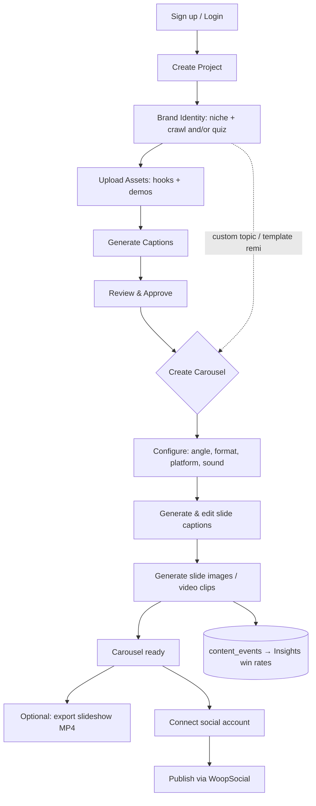

# Mymo — In-App Product & Design Overview

> Repository codename: **CarouselAI** · Product name in-app: **Mymo**

This document describes the product **as it actually exists inside the app** (the
authenticated `/dashboard/`* + `/admin` surfaces and the API/library code that powers
them) and the **design system** those surfaces are built with.

It deliberately ignores the public marketing/landing narrative (which positions Mymo as  
a "UGC video-ad generator with AI actors"). The shipped in-app product is a different,  
narrower thing — and that thing is what's documented here. Where the two diverge, this doc  
describes the code, not the copy.

---

## Part I — What the product is (from the in-app functions)

### 1. In one sentence

**Mymo is a multi-project, brand-aware social-content studio: you create a project, teach**  
**it your brand ("the Brain"), and it generates on-brand multi-slide carousels (static**  
**images, optionally animated to video), then exports them or publishes them to your social**  
**accounts.**

### 2. The mental model

The whole app hangs off five concepts, in this order:

```
Project (workspace)
  └─ Brand Brain (app_identities)        ← who you are / how you talk
       └─ Niche (ecomm | app | personal_brand | viral)
            └─ Content inputs
                 ├─ Assets (hooks + demos)  → Combinations → Captions → Review
                 ├─ Custom topic
                 └─ Template remix (style reference)
                      └─ Carousel (slides) [+ Angle framework]
                           ├─ Export → slideshow MP4
                           └─ Publish → social account (via WoopSocial)
```

Everything a user does is scoped to **one active project at a time**.

### 3. Core objects / concepts


| Concept               | What it is in-app                                                                                                                                                                                                                                                       | Backed by                                                              |
| --------------------- | ----------------------------------------------------------------------------------------------------------------------------------------------------------------------------------------------------------------------------------------------------------------------- | ---------------------------------------------------------------------- |
| **Project**           | A switchable workspace. One user can own many; each has its own brand, assets, carousels, templates, and connections. The active project lives in an httpOnly cookie (`mymo_active_project`).                                                                          | `workspaces` table; `src/lib/workspace/`*                              |
| **Brand Brain**       | The reusable brand profile ("DNA") that powers every generation: tone, audience, value props, terminology, app name/category/tagline, core problem, key outcome, features, competitor, quotes, metric, CTA, brand color, logo, plus a 1–2 sentence `brand_dna` essence. | `app_identities`; `src/lib/carousel/brand-identity.ts`, `variables.ts` |
| **Niche**             | One of `ecomm`, `app`, `personal_brand`, `viral`. Drives labels ("App Identity" vs "Brand Identity"), whether demos are used, and which content frameworks are offered.                                                                                                 | `workspaces.niche`; `src/lib/carousel/niches.ts`                       |
| **Assets**            | Uploaded images: **hooks** (lifestyle/attention imagery) and **demos** (product/app screenshots, only for `app`/`ecomm`).                                                                                                                                               | `assets` + Storage `assets` bucket                                     |
| **Combination**       | A hook (× optional demo) pair with an AI-written caption. The cartesian product of hooks × demos. For demo-less niches it's one caption per hook.                                                                                                                       | `combinations`                                                         |
| **Angle / Framework** | A pre-authored content template (e.g. "Pain Point", "Before/After", "Social Proof") that defines a slide-by-slide skeleton with `[brand variable]` and `{asset}` slots. 9 carousel frameworks (T1–T9) live; 2 video frameworks (V1–V2) ship as disabled data.           | `src/lib/carousel/frameworks/`*                                        |
| **Carousel + Slides** | The generated post: a `carousels` row + N `carousel_slides` (each an AI image, optional video clip, with a text overlay).                                                                                                                                               | `carousels`, `carousel_slides`                                         |
| **Template**          | A public IG/TikTok carousel scraped and re-hosted as a **style reference** for "remix" generation. Either global (admin-curated) or project-private.                                                                                                                    | `carousel_templates` + Storage `templates` bucket                      |
| **Connection**        | A social account linked through WoopSocial (LinkedIn, LinkedIn Page, Instagram, Facebook, TikTok, X).                                                                                                                                                                   | `social_connections`                                                   |
| **Content event**     | Append-only analytics row logged on generate/publish/export, tagged by angle — powers the Insights "win rate" view.                                                                                                                                                     | `content_events`                                                       |


### 4. The in-app surfaces (every page)

Navigation is entirely **sidebar-driven** (no top bar). The sidebar mirrors the pipeline:
**Main** (Overview → Identity → Assets → Generate → Review → Templates) then **Output**
(Carousels → Connections), plus a prominent **Create** button.


| Page                | Route                       | What the user does                                                                                                                                                  |
| ------------------- | --------------------------- | ------------------------------------------------------------------------------------------------------------------------------------------------------------------- |
| **Overview**        | `/dashboard`                | Project CRUD + at-a-glance stat cards (identity, hooks, demos, combinations, carousels, connections) + a 6-step "Get started" checklist with green **Done** badges. |
| **Brand Identity**  | `/dashboard/onboarding`     | Pick a niche → (optional) crawl a website → take the brand quiz → review/edit the full Brain profile.                                                               |
| **Assets**          | `/dashboard/assets`         | Upload/delete hooks (always) and demos (app/ecomm). Shows the combinatorial math (`N hooks × M demos`).                                                             |
| **Generate**        | `/dashboard/generate`       | One-click **bulk caption generation** across all hook×demo combinations.                                                                                            |
| **Review**          | `/dashboard/review`         | Approve / reject / inline-edit captions; filter by status; batch "Approve All Ready".                                                                               |
| **Templates**       | `/dashboard/templates`      | Browse style templates by niche; preview; import from an IG/TikTok URL or manual upload; apply ("remix") into carousel creation.                                    |
| **Create Carousel** | `/dashboard/carousels/new`  | The core creation wizard: **select** source → **configure** (angle, format, platform, slide count, trending sound) → **captions** → **generating** → **done**.      |
| **Carousels**       | `/dashboard/carousels`      | Grid of all carousels with thumbnail, status, platform, video badge; open or delete.                                                                                |
| **Carousel detail** | `/dashboard/carousels/[id]` | Preview slides, regenerate individual slides, export a slideshow MP4, and publish.                                                                                  |
| **Connections**     | `/dashboard/connections`    | Connect/disconnect social accounts via WoopSocial OAuth.                                                                                                            |
| **Insights**        | `/dashboard/insights`       | "Angle Insights": per-angle generated/published/exported counts + win rate. *(Exists but is **not linked in the sidebar** — orphaned route.)*                       |
| **Admin**           | `/admin`                    | Admin-only: choose the AI models for text, image, and video generation.                                                                                             |


### 5. The two content paths

The app supports two ways to reach a finished carousel, and they converge at generation:


| Path                             | Flow                                                                                                         |
| -------------------------------- | ------------------------------------------------------------------------------------------------------------ |
| **Asset / combination pipeline** | Identity → Assets → Generate captions → Review → Create carousel **from an approved combination**            |
| **Direct pipeline**              | Identity → Create carousel from a **custom topic** or a **template remix** (no assets/combinations required) |


### 6. End-to-end workflow (as implemented)




**Progress tracking** appears in three places: the home "Get started" checklist (6 numbered
steps, Done badges), the onboarding step badges (niche → website → quiz), and the 5-step
create-carousel wizard with a live progress bar during generation.

### 7. The generation engine

This is the technical heart of the in-app product.

- **Text (LLM)** — via **EvoLink** (OpenAI-compatible gateway), default `gemini-3.5-flash`.
Used for: parsing crawled HTML and quiz answers into the Brain, writing combination
captions, and writing per-slide carousel copy + post caption + hashtags. Admin-selectable.
- **Brand-aware prompting** — every generation injects the Brain. Frameworks resolve their
`[Target_Audience]`, `[Core_Problem]`, `[App_Name]`, `[CTA_Text]`, etc. slots from the
brand "Variable Dictionary" (`src/lib/carousel/variables.ts`, `inject.ts`).
- **Image (AI)** — EvoLink image models (default `gpt-image-2`; alt `nanobanana-2`). The AI
generates **text-free backgrounds**; up to 16 reference images can be passed (uploaded
assets + a template slide first, for remix).
- **Server-side overlay composition** — captions and UI chrome are **burned onto images
server-side** using `@napi-rs/canvas`, not by the AI, so copy is pixel-sharp and respects
platform safe zones. Five named layouts: `fullbleed_dark_overlay`, `split_compare`,
`testimonial_card`, `notification_mock`, `text_only` (`src/lib/carousel/overlay/`*).
- **Async lifecycle** — image generation is async (`pending → processing → completed/failed`).
The client polls `GET /api/carousel-status/[carouselId]`; on completion the result image is
**downloaded and re-uploaded to Supabase** (stable public URL), then overlaid. Slides
stuck >20 min or whose task 404s are marked `failed`.
- **Video (two pipelines)**:
  1. **Video carousel** — after a slide image completes, EvoLink image-to-video (default
    `seedance-2.0-fast-image-to-video`) animates it; text is burned on via **ffmpeg**.
  2. **Slideshow export** — stitches completed slide images into one MP4 (ffmpeg-static),
    looping each slide for a configurable duration, with optional trending music.
- **Trending sounds** — `TrendingSoundPicker` queries `GET /api/trends` (EnsembleData TikTok
sounds) using keywords auto-derived from the brand; the chosen sound is stored on the
carousel and used in export.

**Platform → aspect ratio:** `instagram` → 1:1, `tiktok` → 9:16, `both` → 4:5.

### 8. Publishing

Handled entirely by **WoopSocial**, a single managed provider (one `WOOPSOCIAL_API_KEY`, no
per-platform developer apps). Connect = hosted OAuth; the credentials live with WoopSocial.
Publish (`POST /api/publish/[carouselId]`) uploads slide images to WoopSocial's media
library, validates, then creates a `PUBLISH_NOW` post for the target platform with
per-platform fields. Success flips `social_posts` and the carousel to `published`.

### 9. Admin

`/admin` (gated by `ADMIN_EMAILS`) exposes **model settings** only: the text, image, and
video model slugs used across the app, stored as a singleton `app_settings` row written with
the Supabase service-role key.

### 10. Data model (in-app)

All tables use **Row-Level Security** scoped to the user via the workspace chain. Key tables:
`workspaces`, `app_identities`, `assets`, `combinations`, `carousels`, `carousel_slides`,
`carousel_templates`, `social_connections`, `social_posts`, `content_events`, `app_settings`.
Public Storage buckets: `assets`, `carousels`, `templates`. A recurring design pattern is
**graceful degradation** — newer columns are tried first, then stripped and retried so older
databases still run.

### 11. Real vs. placeholder (important caveats)

- **Insights** works but isn't linked in the nav (direct-URL only).
- **Plan/usage card** in the sidebar shows **hardcoded placeholder** numbers — not wired to
any billing/usage source.
- **No checkout/billing** exists in-app.
- **Video frameworks (V1–V2)** are present as data but flagged `disabled`.
- The home **"Review & Export"** step never auto-marks Done, and export actually lives on the
carousel detail page, not the Review page.

---

## Part II — Design overview

### 1. Design language

**Neo-brutalism on a warm cream canvas.** The aesthetic is built from three repeated moves:

1. **Hard 2px black borders** (`border-2 border-black`) on nearly every surface.
2. **Hard, blur-less offset shadows** (`box-shadow: Npx Npx 0 0 #000`).
3. **"Press" micro-interactions** — on hover/active, elements translate down-right by 1–2px
  while their shadow shrinks, mimicking a physical button press.

The result is a tactile, high-contrast, utilitarian UI. It's confident and playful rather
than corporate-minimal. The dashboard is intentionally more restrained than the marketing
site: it drops the decorative display fonts and marquee animations and sticks to Inter +
brutalist cards.

### 2. Color system

**Tokens** (`src/app/globals.css`):

```css
--background / --surface : #fbf9f6   /* warm cream — app shell + body */
--foreground             : #0a0a0a   /* near-black text */
--ember                  : #e85d24   /* PRIMARY accent (the brand orange) */
--ember-hover            : #d0521f   /* primary hover */
--primary                : #eb512b   /* defined but unused in-app */
--primary-foreground     : #ffffff
```

> Note: there are two oranges (`--ember` and `--primary`). The dashboard uses `**--ember`
> exclusively**; `--primary` is effectively dead in-app.

**Neutral text ramp** (inline hex, not tokenized):


| Hex       | Role                                                       |
| --------- | ---------------------------------------------------------- |
| `#1a1a1a` | Primary body / nav text                                    |
| `#333`    | Secondary UI text                                          |
| `#444`    | Modal body copy                                            |
| `#666`    | **Default muted / subtitle text** (most page descriptions) |
| `#999`    | Placeholders, disabled, empty-state icons                  |
| `#ccc`    | Empty thumbnail placeholders                               |


Black is also used at opacity for labels/dividers/overlays: `#0a0a0a/45`, `black/5`,
`black/10`, `black/15`, `black/70`.

**Status colors** (consistent across cards, badges, banners):


| Status                           | Treatment                       |
| -------------------------------- | ------------------------------- |
| pending / draft                  | `bg-gray-100 text-gray-600`     |
| generating                       | `bg-yellow-100 text-yellow-700` |
| ready                            | `bg-blue-100 text-blue-700`     |
| approved / completed / published | `bg-green-100 text-green-700`   |
| rejected / failed                | `bg-red-100 text-red-600`       |


**Accent usage patterns:**

- Filled CTA: `bg-[var(--ember)] hover:bg-[var(--ember-hover)] text-white border-2 border-black`
- Tinted surface: `bg-[var(--ember)]/5 border-2 border-[var(--ember)]` (callouts, DNA preview)
- Icon well / pill: `bg-[var(--ember)]/10 text-[var(--ember)]`
- Selected / focus: `ring-2 ring-[var(--ember)]`, `border-[var(--ember)]`, sometimes
`shadow-[3px_3px_0_0_var(--ember)]`

**Decorative gradients** (niche cards only): Ecomm `from-orange-400 to-rose-500`, App
`from-sky-400 to-indigo-500`, Personal Brand `from-violet-400 to-fuchsia-500`, Viral
`from-emerald-400 to-teal-500`.

**Platform brand colors** (connection cards): Instagram `from-purple-600 to-pink-500`,
TikTok/X `black`, LinkedIn `#0A66C2`, Facebook `#1877F2`.

### 3. Typography

The app loads several fonts (Inter, Geist, Geist Mono, Instrument Serif, Caveat, Satoshi,
Gambarino) but the **dashboard is effectively Inter-only**, with `font-mono` (Geist Mono) for
the occasional code/env snippet. The display/serif/handwritten fonts are used by marketing,
not the app.


| Element              | Classes                                                                |
| -------------------- | ---------------------------------------------------------------------- |
| Page title           | `text-2xl font-bold tracking-tight`                                    |
| Page subtitle        | `text-[#666] mt-1`                                                     |
| Section / card title | `text-lg font-semibold` or `text-lg font-bold`                         |
| Stat value           | `text-3xl font-bold tracking-tight`                                    |
| Body                 | `text-sm`                                                              |
| Helper / caption     | `text-xs text-[#666]` / `text-[#999]`                                  |
| Micro labels         | `text-[10px]` / `text-[11px]`                                          |
| Section overline     | `text-[11px] font-semibold uppercase tracking-wider text-[#0a0a0a]/45` |


Weights used: `font-medium`, `font-semibold`, `font-bold` (no light/thin). `tracking-tight`
on titles/stats; `tracking-wide(r)` on uppercase overlines.

### 4. Layout & shell

```
<div className="flex min-h-screen bg-[var(--surface)]">
  <Sidebar />                                  {/* sticky, full-height */}
  <main className="flex-1 min-w-0 overflow-auto p-6 sm:p-8">{children}</main>
</div>
```

- **Sidebar:** `272px` expanded / `76px` collapsed (`transition-[width] duration-200`),
`sticky top-0 h-screen`. Its background is a **photographic sky** lifted from the landing
hero, washed with white gradients and a right-edge fade into the cream surface, so it melts
seamlessly into the content area.
- **Content area:** `p-6` (mobile) → `sm:p-8` (desktop), no top navbar.
- **Page width:** most pages `max-w-5xl mx-auto space-y-8`; narrow pages (Connections, empty
states) `max-w-3xl`.
- **Vertical rhythm:** `space-y-8` between sections; grids use `gap-4`/`gap-5`.
- **Responsive grids:** stats `grid-cols-1 sm:grid-cols-2 lg:grid-cols-4`; content cards
`grid-cols-1 sm:grid-cols-2 lg:grid-cols-3` (templates up to 4).

Active nav item — the canonical "ember + brutalist" treatment:

```77:82:src/components/dashboard/sidebar.tsx
          "flex items-center gap-3 rounded-lg px-3 py-2.5 text-sm font-medium transition-colors",
          active
            ? "bg-[var(--ember)] text-white shadow-[2px_2px_0_0_#000]"
            : "text-[#1a1a1a] hover:bg-white/70",
          collapsed && "justify-center px-0",
```

### 5. Elevation & borders (the shadow scale)

Hard offset shadows replace soft elevation. The size encodes hierarchy:


| Shadow                              | Use                                                  |
| ----------------------------------- | ---------------------------------------------------- |
| `shadow-[6px_6px_0_0_#000]`         | Modals                                               |
| `shadow-[4px_4px_0_0_#000]`         | Primary cards (stat, brand identity, generate panel) |
| `shadow-[3px_3px_0_0_#000]`         | List/grid cards, the sidebar **Create** button       |
| `shadow-[2px_2px_0_0_#000]`         | Small buttons, dropdowns, active nav                 |
| `shadow-[1px_1px_0_0_#000]`         | Pressed/hover state                                  |
| `shadow-[3px_3px_0_0_var(--ember)]` | Selected template card                               |


**Border vocabulary:** `border-2 border-black` (default), `border-2 border-dashed border-gray-300` (dropzones/empty states), `border-b-2 border-black` (headers/dividers),
`border-2 border-red-300` (destructive).

**Prevalence** (across dashboard scope): `border-2 border-black` ≈ 88 uses, hard `shadow-[…]`
≈ 101 uses, the press translate ≈ 42 files. Neo-brutalism is pervasive, not occasional.

### 6. Shape / radius


| Radius         | Use                                            |
| -------------- | ---------------------------------------------- |
| `rounded-2xl`  | Niche selection cards                          |
| `rounded-xl`   | Cards, modals, dropdowns, upload zones         |
| `rounded-lg`   | Buttons, inputs, nav items                     |
| `rounded-md`   | Icon buttons, small overlay controls           |
| `rounded-full` | Status badges, avatars, nav dots, toggle knobs |


### 7. Component catalog

There is **no shared UI kit** (the `src/components/ui/` folder only holds a marketing
`marquee` that the dashboard doesn't use). Instead, the brutalist pattern is consistently
re-applied across purpose-built dashboard components. The shared "card shell" is:

```
bg-white border-2 border-black rounded-xl p-[4|5|6] shadow-[3px|4px ...] + hover press
```

Representative card (`StatCard`):

```12:19:src/components/dashboard/stat-card.tsx
    <div className="bg-white border-2 border-black rounded-xl p-5 shadow-[4px_4px_0_0_#000] transition-[transform,box-shadow] duration-200 hover:translate-x-[1px] hover:translate-y-[1px] hover:shadow-[3px_3px_0_0_#000]">
      <div className="flex items-center justify-between mb-3">
        <span className="text-sm font-medium text-[#666]">{label}</span>
        <div className="w-9 h-9 rounded-lg bg-[var(--ember)]/10 flex items-center justify-center">
          <Icon className="w-5 h-5 text-[var(--ember)]" />
        </div>
      </div>
      <p className="text-3xl font-bold tracking-tight">{value}</p>
```

**Cards:** `StatCard`, `BrandIdentityCard`, `BrainProfileEditor`, `PlanUsageCard`,
`TemplateCard`, `CombinationCard`, `SlideCard`, `SocialConnectCard`, `CarouselPreview`,
`VideoExportPanel`, `NicheSelect`, `ProjectOverview`, `NoProjectNotice`.

**Buttons (tiers):**


| Tier          | Treatment                                                                                                                   |
| ------------- | --------------------------------------------------------------------------------------------------------------------------- |
| Primary       | `bg-[var(--ember)] hover:bg-[var(--ember-hover)] text-white border-2 border-black shadow-[3px_3px_0_0_#000]` + press        |
| Secondary     | `bg-black text-white border-2 border-black`                                                                                 |
| Ghost         | `border-2 border-black bg-white hover:bg-gray-50`                                                                           |
| Chip (toggle) | unselected `bg-white text-[#666] border-gray-200 hover:border-black` → selected `bg-[var(--ember)] text-white border-black` |
| Destructive   | `bg-red-50 hover:bg-red-100 text-red-600` (soft, usually no shadow)                                                         |
| Text link     | `text-[var(--ember)] font-semibold hover:underline`                                                                         |


**Badges/pills:** `text-[10px] font-semibold px-2 py-0.5 rounded-full` + the status color map.

**Inputs:** `w-full px-3 py-2 border-2 border-black rounded-lg text-sm focus:outline-none focus:ring-2 focus:ring-[var(--ember)]`. Custom toggle switch in the publish modal
(`h-5 w-9 rounded-full border-2 border-black` with a sliding knob).

**Modals:** `fixed inset-0 z-50 bg-black/50` backdrop → `bg-white border-2 border-black rounded-xl shadow-[6px_6px_0_0_#000] max-h-[90vh] overflow-y-auto`, header
`border-b-2 border-black`, title `text-lg font-bold`. Examples: `PublishModal`,
`TemplatePreviewModal`, `AddTemplateModal`, brand identity modal.

### 8. Iconography & media

- **Icons:** `lucide-react` throughout — nav/section `h-5 w-5`, inline actions `w-3.5/w-4`,
empty states `w-12 h-12`, loaders `Loader2 animate-spin`. Custom inline SVGs for platform
logos.
- **Media:** `aspect-square` dominates (slides, templates, combinations, thumbs) with
`object-cover`. Placeholders are `bg-gray-50` + a `#ccc` icon. Overlay labels (slide #,
"Hook", "Demo") use `bg-black/70 text-white text-[10px]`. Videos render with
`controls loop muted playsInline` and a poster. Carousel preview uses circular
`bg-white/90 border-2 border-black` chevron controls; template hover reveals
preview/delete chips via `opacity-0 group-hover:opacity-100`.

### 9. Motion & interaction

- **Signature motion:** the press — `transition-[transform,box-shadow] duration-200` with
`hover:translate-x-[1px] hover:translate-y-[1px]` (2px on niche cards) + shadow shrink.
- **Other transitions:** `transition-colors` (nav, links), `transition-[width]` (sidebar),
group-hover opacity (template actions).
- **Loading:** centered/inline `Loader2` spinners only — **no skeletons/shimmer** anywhere.
- **Disabled:** `disabled:opacity-50/60`, often canceling the press
(`disabled:hover:translate-x-0 …`).
- **Alerts:** soft, shadow-less banners — success `bg-green-50 border border-green-200`,
error `bg-red-50 border border-red-200`, warning `bg-amber-50 border border-amber-200`.
- **Not used in-app:** the `.btn-3d`, `@keyframes marquee`, and `.animate-scroll-up`*
utilities from `globals.css` are marketing-only; the dashboard reimplements the press
inline.

### 10. Quick-reference tokens

```css
/* Surfaces */
--surface:    #fbf9f6;
--foreground: #0a0a0a;

/* Brand accent (in-app primary) */
--ember:       #e85d24;
--ember-hover: #d0521f;

/* Typography */
font-sans: Inter;       /* default UI */
font-mono: Geist Mono;  /* code only */

/* Hard-shadow elevation scale */
modal:   6px 6px 0 0 #000;
card-lg: 4px 4px 0 0 #000;
card-md: 3px 3px 0 0 #000;
card-sm: 2px 2px 0 0 #000;
pressed: 1px 1px 0 0 #000;

/* Border + muted text */
border: 2px solid #000;
muted:  #666;
subtle: #999;
```

### 11. Design observations / inconsistencies

- **Two brand oranges** (`--ember` vs `--primary`) — only ember is used; `--primary` is dead.
- **No design-token abstraction** — colors like `#666`/`#999` and the shadow values are
repeated inline rather than centralized, so the system is consistent by convention, not by
enforcement.
- `**src/components/ui/` is effectively empty for the app** — patterns are duplicated across
dashboard components instead of shared primitives.
- **Marketing ↔ app bridge** is the sky-photo sidebar; otherwise the two halves of the app
diverge sharply in fonts and motion.

---

## Appendix — file map for this overview


| Area                       | Key files                                                                                                             |
| -------------------------- | --------------------------------------------------------------------------------------------------------------------- |
| Design tokens / global CSS | `src/app/globals.css`, `src/app/layout.tsx`                                                                           |
| Shell & nav                | `src/app/dashboard/layout.tsx`, `src/components/dashboard/sidebar.tsx`, `sidebar-profile.tsx`, `project-switcher.tsx` |
| Components                 | `src/components/dashboard/`*, `src/components/admin/*`                                                                |
| Projects                   | `src/lib/workspace/*`, `src/components/dashboard/project-provider.tsx`                                                |
| Brand Brain                | `src/lib/carousel/brand-identity.ts`, `brand-prompt.ts`, `brand-quiz-questions.ts`, `variables.ts`, `inject.ts`       |
| Niches                     | `src/lib/carousel/niches.ts`                                                                                          |
| Frameworks                 | `src/lib/carousel/frameworks/{library,index,types}.ts`                                                                |
| Image overlay              | `src/lib/carousel/overlay.ts`, `overlay/{layouts,primitives}.ts`, `production-rules.ts`                               |
| Video                      | `src/lib/carousel/video.ts`, `video-export.ts`, `src/components/dashboard/video-export-panel.tsx`                     |
| Trends                     | `src/lib/trends/*`, `src/app/api/trends/route.ts`, `src/components/dashboard/trending-sound-picker.tsx`               |
| Analytics / Insights       | `src/lib/analytics/events.ts`, `src/app/dashboard/insights/page.tsx`                                                  |
| AI clients                 | `src/lib/openai/client.ts`, `src/lib/evolink/*`, `src/lib/settings/*`                                                 |
| Social                     | `src/lib/social/woopsocial.ts` (publish), `scraper.ts` (template import)                                              |
| API routes                 | `src/app/api/*`                                                                                                       |
| DB                         | `supabase/migrations/*`                                                                                               |


> For business positioning, pricing, and the marketing-vs-app divergence, see the companion
> `PROJECT_OVERVIEW.md`. This document is the **in-app product + design** counterpart.

